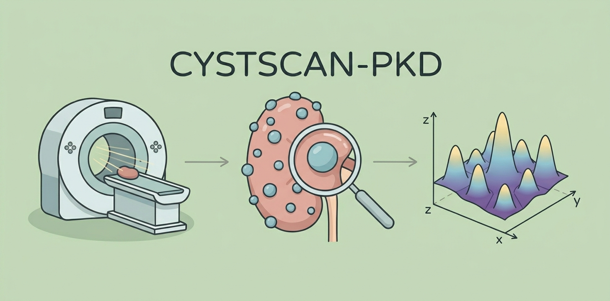

<p align="center">
  
</p>

# CYSTSCAN-PKD

[](https://www.python.org/)
[](https://www.mathworks.com/)
[](LICENSE)
[](https://doi.org/10.5281/zenodo.19049543)
[](https://doi.org/10.5281/zenodo.19097241)
<!-- When paper DOI is available, replace the badge below with: [](https://doi.org/10.XXXX/XXXXX) -->


Automated cyst segmentation and counting in polycystic kidney disease (PKD) microCT scans.

The segmentation pipeline automatically segment kidney and cysts from microCT scans, using the nnU-Net framework. The algorithm detects cysts via distance-transform peak detection from the segmentation masks. A genetic algorithm is used to optimise the six algorithm parameters against manual counts from an Optimization set; performance is then measured on a separate Evaluation set using counts from two independent operators.

This repository accompanies the paper:

> *CYSTSCAN-PKD: a comprehensive pipeline for automatic cyst segmentation and counting on µCT scans from PKD animal models*, A. Mangili, A. Arrigoni, F. Sangalli, S. Fest-Santini, D. Corna, D. Cerullo, C. Xinaris, S. Tomasoni, M. Santini, A. Remuzzi, A. Caroli, *Computers in Biology and Medicine*, 2026. DOI: [DOI pending]

---

## Data

The dataset is available on Zenodo (access upon request): <https://doi.org/10.5281/zenodo.19049543>

After downloading, extract and place the two folders inside `data/`:

```
CYSTSCAN-PKD/
└── data/
    ├── 1_Segmentation_pipeline/
    │   ├── Dataset1/                    (KRATS scans)
    │   │   ├── Training Set/
    │   │   │   ├── Images/              (20 NIfTI files, *_0000.nii.gz)
    │   │   │   └── Ground Truth/        (20 NIfTI files, label 1=kidney, label 2=cyst)
    │   │   └── Test Set/
    │   │       ├── Images/              (5 NIfTI files)
    │   │       ├── Ground Truth/        (5 NIfTI files)
    │   │       └── Inferences/          (pre-computed masks, one subfolder per model)
    │   └── Dataset2/                    (XRATS scans)
    │       ├── Images/                  (5 NIfTI files)
    │       ├── Ground Truth/            (5 NIfTI files)
    │       └── Inferences/              (pre-computed masks, one subfolder per model)
    └── 2_Cyst_counting_pipeline/
        ├── Optimization set/
        │   ├── Cyst masks/              (10 NIfTI files, label 1=kidney, label 2=cyst)
        │   └── O1_count.xlsx            (manual counts, Operator 1)
        └── Evaluation set/
            ├── Cyst masks/              (10 NIfTI files)
            └── O1_O2_counts.xlsx        (manual counts, Operators 1 and 2)
```

The cyst counting pipeline (MATLAB and Python) reads only the files under `2_Cyst_counting_pipeline/`.
The segmentation pipeline reads raw scans from `1_Segmentation_pipeline/`. Model weights are downloaded automatically and do not require Zenodo access; see [Segmentation](#segmentation) below.

---

## MATLAB

**Requirements:** MATLAB R2020b or later with the Image Processing, Statistics & Machine Learning, Parallel Computing, and Global Optimization toolboxes.

```matlab
cd matlab/

% Optimise parameters on the Optimization set
run_optimization

% Evaluate on the Evaluation set
run_evaluation           % uses parameters from the step above
% or
run_evaluation_paper     % uses the published parameters, no optimisation needed
```

For sensitivity analysis and statistical plots, see [matlab/README.md](matlab/README.md).

---

## Python

**Requirements:** Python 3.10 or later.

```bash
pip install -r python/requirements.txt

# Optimise parameters
python python/run_optimization.py

# Evaluate on the Evaluation set
python python/run_evaluation.py          # uses GA-generated parameters
# or
python python/run_evaluation_paper.py    # uses published parameters
```

For details on differences from the MATLAB version, see [python/README.md](python/README.md).

---

## Statistical plots (R)

After running either evaluation script, Bland-Altman and regression plots can be generated in R:

```bash
Rscript matlab/statistical_analysis.R
# or open matlab/statistical_analysis.R in RStudio and run it
```

Requires: `readr`, `ggplot2`, `dplyr`.
An equivalent Python script is available at `python/bland_altman_plots.py`.

---

## Segmentation

The segmentation step (kidney + cyst masks from raw microCT scans) uses pre-trained nnUNet v2 models.

**Model weights** (~1.2 GB per model) are downloaded automatically from Zenodo
(<https://doi.org/10.5281/zenodo.19097241>) on first use — no manual setup required.

**Raw scan data** for reproducing the segmentation results is available on Zenodo (access upon request)
at <https://doi.org/10.5281/zenodo.19049543> (same record as the dataset above).
Place the downloaded data under `data/1_Segmentation_pipeline/` as shown in [Data](#data).
The `Images/` folders use the nnUNet naming convention (`*_0000.nii.gz`);
strip the `_0000` suffix before passing a file to `run_inference.py`
(e.g. use `--input path/to/KRATS_024.nii.gz`, not `KRATS_024_0000.nii.gz`).

**Requirements:** `nnunetv2`, `SimpleITK`, `scipy`, `requests`, `tqdm`

```bash
# Step 1 – segment a scan (downloads weights on first run, ~1.2 GB)
python -m segmentation.run_inference \
    --input  path/to/scan.nii.gz \
    --model  n20 \
    --output path/to/output/ \
    --models-dir ./models/

# Step 2 – count cysts in the segmentation mask
python -m segmentation.count_cysts \
    --input-dir path/to/output/ \
    --output    cyst_counts.csv
```

Available models: `n5`, `n10`, `n15`, `n20` (2-channel: microCT + Sobel edges), `n5_1C` (1-channel baseline).
See [segmentation/README.md](segmentation/README.md) for module details, or [workflows/segment_kidneys.md](workflows/segment_kidneys.md) for a complete step-by-step guide including prerequisites, troubleshooting, and running both steps in sequence.

---

## Repository structure

```
CYSTSCAN-PKD/
├── data/                        (Zenodo data goes here)
├── segmentation/                (segmentation module: download, preprocess, infer, count)
├── matlab/                      (MATLAB pipeline)
├── python/                      (Python pipeline)
├── tools/                       (utility scripts, e.g. Zenodo packaging)
├── workflows/                   (step-by-step SOPs)
└── results/                     (created automatically at runtime)
    ├── optimization/
    ├── evaluation/
    ├── evaluation_paper/
    └── sensitivity_analysis/
```
